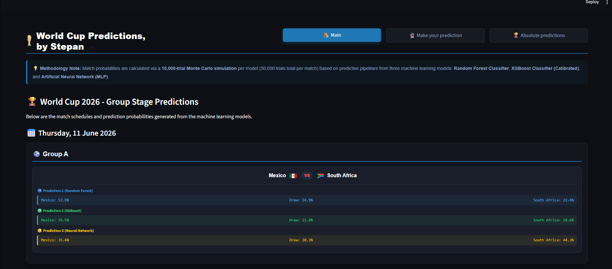
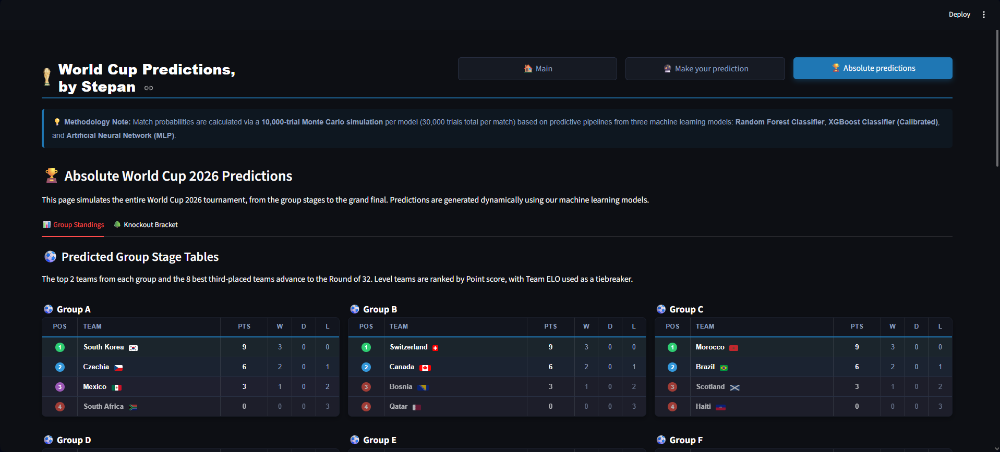
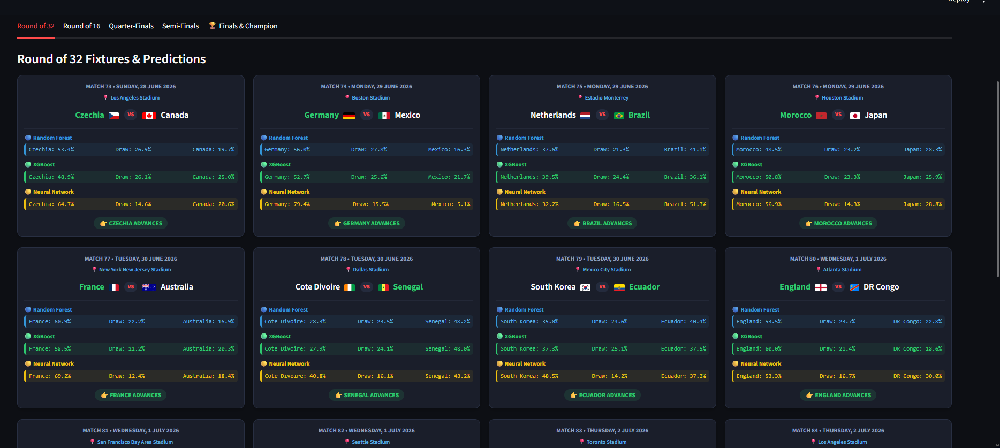

# 🏆 World Cup 2026 Predictions

**[Try the Live Streamlit App Here](https://wc-pred-stepan.streamlit.app)**

An end-to-end Machine Learning pipeline and interactive web application that predicts the outcome of the 2026 FIFA World Cup. 

The models used for this project are Random Forest Classifier, (Calibrated) XGBoost, MLP Classifier (Neural Network) combined with a **10,000-trial Monte Carlo simulation** to realistically forecast the entire tournament bracket.

## 🚀 Features
* **Ensemble Learning:** use of Random Forests and XGBoost algorithms
* **Monte Carlo Simulation:** 10.000 simulations of the knockout bracket to calculate stable, mathematically sound probabilities for tournament winners.
* **Interactive UI:** A fully responsive webapp made with Streamlit, featuring a dark-mode interface, team flags, and prediction bars.
* **Custom Data Pipeline:** Includes scraping data from sofascore api (see src/ETL/Extract/scraper.py), feature engineering, scaling, and imputation for team ELOs and rolling statistics. Used Time Series and date sorting, so that the models are trained by the real time performance of each country.


## 📸 Screenshots







## 🤖 AI & Development Workflow

Transparency is important in modern software engineering. To build an end-to-end MLOps pipeline and web application, I utilized a hybrid development approach:

* **Core ETL, Data Science & Machine Learning (Built Manually):** I manually developed the foundational data science architecture. This includes writing the ETL pipeline, cleaning the raw data, engineering complex features (like rolling averages and ELO ratings), and training/evaluating the Random Forest, XGBoost, and Neural Network models from scratch. 
* **Streamlit App (AI-Assisted):** To scale the project to a fully interactive cloud application, I leveraged Google Gemini as my AI coding assistant. Acting as the technical architect, I prompted the solution, the plan and the architecture to accelerate the development of the Streamlit user interface and format the HTML/CSS components.

This workflow allowed me to focus my primary learning on the underlying mathematics and machine learning algorithms, while utilizing industry-standard AI tools to rapidly ship a production-grade frontend.

## Project Structure


```
World_Cup_Project
├─ api.py
├─ app.py
├─ Data
│  ├─ cleaned
│  │  ├─ data_describe.csv
│  │  ├─ input_data.csv
│  │  ├─ teams_data.csv
│  │  └─ training_data.csv
│  └─ raw
│     └─ nations_data.csv
├─ Images
│  ├─ EDA
│  │  ├─ correlation_matrix.png
│  │  ├─ correlation_with_home_win.png
│  │  ├─ elo_diff_vs_outcome.png
│  │  ├─ elo_distribution.png
│  │  ├─ final_results_distribution.png
│  │  ├─ missing_values.png
│  │  ├─ outcomes_by_tournament.png
│  │  ├─ outcome_props_by_elo_quintiles.png
│  │  └─ performance_metrics_comparison.png
│  └─ World_Cup_Trophy
│     └─ World_Cup.png
├─ mlflow_script.py
├─ Notebooks
│  ├─ EDA.ipynb
│  ├─ Images
│  │  ├─ Model_Metrics
│  │  │  ├─ cross_val_score_of_plot.png
│  │  │  └─ test_set_performance.png
│  │  └─ Model_Performance
│  └─ model_metrics.ipynb
├─ README.md
├─ requirements.txt
└─ src
   ├─ ETL
   │  ├─ Extract
   │  │  ├─ scraper.py
   │  │  └─ __init__.py
   │  ├─ Load
   │  │  └─ data_inspection.ipynb
   │  ├─ Transform
   │  │  ├─ feature_engineering.py
   │  │  └─ __init__.py
   │  └─ __init__.py
   ├─ Models
   │  ├─ pipeline.py
   │  ├─ train.py
   │  └─ __init__.py
   └─ __init__.py

```
